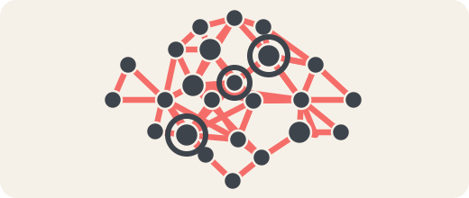

  

# Spore

An infrastructure for collective agency — a common grammar for plural, sovereign coordination across scales and scopes.

The project develops **Agent Commons**: a pattern language, protocol family, and governance-memory pattern for coordination and coherence without surrendering sovereignty. Here "agent" means any entity with enough coherence to perceive, decide, and act — a person, an AI, a team, an organization, a federation, a mixed human-AI collective.

**Spore** is the project. **Agent Commons** is the protocol family it publishes.

Why "Spore"? A spore is portable, generative, and context-sensitive: it moves through larger living networks, lands in a place, and unfolds locally. Spore follows the same logic — a shared coordination grammar that can land across projects, grow in different forms, and remain interoperable without requiring centralization.

At a high level, Spore's grammar has two kinds of primitives. **Structural primitives** (fields, holons, membranes) describe the substrate of coordination — the shape of the coordination space. **Coordination verbs** (intents, commitments, joint-commitments, evidence, signals, reproduction) describe the operations through which agents coordinate across that substrate. A field is the shared coordination space between holons; a holon is a part-whole recursive unit (a person, a team, a federation are holons at their respective scales); a membrane is the semi-permeable interface between a holon and its field, or between holons. Gardens are cultivated regions within a field where knowledge is actively tended.

## The Problem

As the number of agents, scales, and overlapping memberships grows, coherence degrades. Intentions become invisible. Dependencies become implicit. Memory fragments across tools, teams, and time. The usual responses are well-documented: compress variety through centralized control (legible but brittle), or let structure dissolve into informal networks (flexible but incoherent). Both are failure modes. The third path — adaptive coordination through shared grammar, explicit memory, and iterative sensing — is what Spore works toward.

## The Coordination Ecology

Coordination happens through six verbs operating across the structural primitives:

- **Intents** signal — offers, needs, conditions, declared stances; where plurality enters the grammar
- **Commitments** bind — accepted, scope-bound, governed individual-scale bindings
- **Joint-commitments** bind jointly — irreducibly-joint bindings between parties that cannot be analyzed as sums of personal commitments (federation protocol-adoption is the paradigm case)
- **Evidence** grounds — attested records of execution, observation, fulfillment
- **Signals** transmit — live coordination state, stigmergic traces, algedonic alerts
- **Reproduction** sustains — the coordination labor that keeps the loop running across episodes, actor turnover, and generational succession

These verbs form a loop: intents become commitments, commitments produce evidence, evidence feeds the next round of intents. Signals run alongside as live transmission; reproduction sustains the loop across episodes. Not all intents become commitments — the space between intention and binding is where plurality lives. Visions, roadmaps, policies, and role definitions are artifact-types that some contexts author to organize commitments over longer time-horizons; they are not primitives in the grammar.

## What Holds It Together

**Constitutional commitments** — provenance, forkability, pluralism, meaningful autonomy, authorized boundary crossing, reviewable authority, contestability. These are chosen design commitments, not eternal truths. Together they define the conditions of relational freedom: the structural ground that makes coordination possible without requiring convergence.

**Containment and overlap** — the holonic axis organizes nested integrity; the network axis organizes cross-cutting participation and lateral reach. The result is a semilattice, not a tree. Living systems cannot be captured by a single clean hierarchy, and neither can the coordination structures that serve them.

**Dual representation** — every governance artifact exists as text (for humans) and graph projection (for machines), so the grammar remains legible at both speeds. Graph projections are locally queryable representations that can be selectively federated, rather than one continuously live global graph.

The full argument lives in [project-vision.md](docs/project-vision.md).

## Documentation

- [**Project Vision**](docs/project-vision.md) — what Spore is, why it exists, what it is for
- [**Coordination Grammar**](docs/synthesis/coordination-grammar.md) — working synthesis of the grammar's primitives and patterns
- [**Documentation Map**](docs/README.md) — full map of foundations, patterns, protocols, and governance docs
- [**Roadmap**](docs/roadmap.md) — where the project is headed

Spore learns from the wider coordination ecosystem through a learning membrane — a comparative intake process that ingests external frameworks, translates them into bridge notes, comparative notes, and claims as appropriate, and selectively promotes what proves useful into canon. The membrane exercises the same boundary-crossing operations that govern all exchange in the grammar. Bridge notes are source-specific; comparative notes record multi-tradition support for enacted canon/foundation language. These research connections live in [docs/research/connections/](docs/research/connections/).

In this vocabulary, the learning membrane tends a knowledge garden within the wider learning field. The canonical definition of `field` lives in [docs/foundations/lexicon/field.md](docs/foundations/lexicon/field.md).

## What Encounter Looks Like

You do not migrate into Spore as a platform. You let your project speak more of the grammar by adding coordination surfaces — legible intent, shared memory, commitment protocols — at whatever pace makes sense. A project can use one pattern without adopting the full stack. Adoption is incremental and reversible. Spore is designed for coexistence with existing systems, not total rupture.

For concrete steps, see the [adoption guide](docs/governance/adoption-guide.md).

## Canon scope and inter-canon roles

Spore defines a grammar and publishes patterns and protocols. Others adopt and implement them. A Spore instance is any project that implements some composition of the grammar's patterns. Spore is one of several canon-bearing repositories in the agent-commons ecosystem; each canon-bearing peer owns a distinct concern, and cross-canon citations are disciplined to prevent role-confusion.

| Canon | Owns | Relationship to Spore |
|---|---|---|
| **Spore** (this repo) | Coordination grammar — primitives, doctrines, modes, properties, patterns, foundation docs, ADRs | — |
| **Intelligence Commons** (IC) | Intelligence primitives — retrieval, memory layers, grounding, agentic control | Downstream-aligned; tracks Spore via cross-repo alignment ADRs |
| **Poietic Match** (PM) | Sovereignty-preserving compositional matchmaking — protocol-objects (Intent, CommitmentBundle, TrustAttestation, MatchProposal) | Downstream-aligned; tracks Spore via cross-repo alignment ADRs |
| **[bioregional-coordination](https://github.com/DarrenZal/bioregional-coordination)** | Agentic bioregionalism — meta-articulation of Spore primitives at bioregional scope | Peer instance-family member; cites Spore at upstream-reference layer (not fork; not downstream sibling) |
| **[BKC / Octo](https://github.com/BioregionalKnowledgeCommons/Octo)** | Operational instance — seven-layer stack (mapping → graph → commitment-pool → flow-funding → AI agents → federation → bioregional finance), Greater Victoria pilot | Peer instance-family member; downstream-by-citation (frontmatter `depends_on: spore.<slug>`); peer in the family of instances |

**Cite Spore for:** any coordination-grammar question, any ADR-numbered decision, any pattern-library entry, the `spore:ADR-NNNN-<slug>` cross-canon citation convention.

**Don't cite Spore for:** bioregional-specific operational detail (BKC owns); financial-instrument enumeration (BKC owns); intelligence-primitive specifics (IC owns); compositional-matchmaking protocol-objects (PM owns); bioregional-scope meta-articulation (bioregional-coordination owns).

For the AI-agent navigation frame this role-pinning supports, see [`docs/positioning/agents-and-canons.md`](docs/positioning/agents-and-canons.md).

### Infrastructure

Canon does not run by itself — these repos provide the operational substrate (not canon-bearing peers):

- **[koi-processor](https://github.com/RegenAI/koi-processor)** — node substrate: epistemic graph (public-facing `knowledge graph` gloss), entity resolution, federation, sensors

## Status

Early stage. Working implementations at small scale across 4 projects. The pattern language and conventions are evolving.

## License

[Peer Production License](https://wiki.p2pfoundation.net/Peer_Production_License) (PPL) — a copyfair license derived from CC BY-NC-SA 3.0. Free for non-commercial use, cooperatives, and worker-owned collectives. See [LICENSE](LICENSE).
